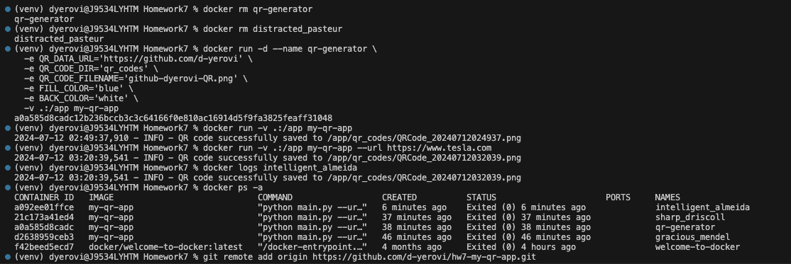
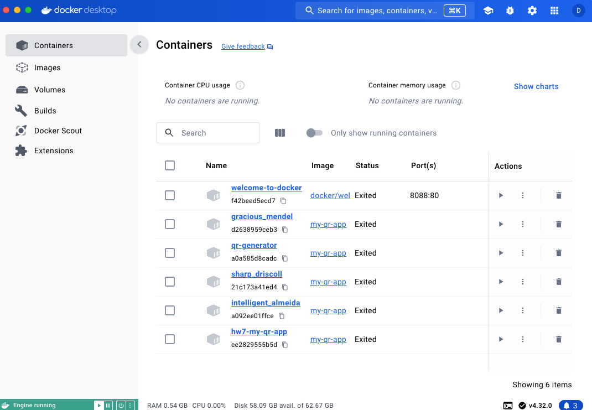

# Docker and Python

For this assignment you will be combining Docker with Python to create a program that generates a QR code PNG file that contains a URL. The QR code can be viewed with the camera on your phone to allow a user to click on it and send them to the target website. You must make your program generate a QR code that takes someone to your GitHub homepage i.e. https://github.com/d-yerovi

## Submission Requirements:

1. Add the QR code image that links to your own GitHub homepage that you generate to the readme.md file, so that it appears below.
#### QR code in Blue for https://github.com/d-yerovi
 

#### QR code for https://github.com/d-yerovi/hw7-my-qr-app.git
 

#### QR code for https://www.tesla.com
 

2.  Add an image of viewing the log of successfully creating the QR code below.
#### Docker QR logs
 

#### Docker Desktop Containers
 

# QR Code Generator
This is a Python script that generates a QR code from a given URL and saves it to a file.

## Features
* Generates a QR code from a valid URL
* Saves the QR code to a file in a specified directory
* Allows customization of the QR code's fill color and background color
* Uses a timestamped filename to ensure unique file names

## Usage
**Setup Instructions**
--------------------

1. Clone the repository: `git clone https://github.com/d-yerovi/hw7-my-qr-app.git`
2. Install the required packages: `pip install -r requirements.txt`
3. Create and activate the virtual environment (VE).
    * Create - `virtualenv venv` or `virtualenv -p python3`
    * Activate - `source venv/bin/activate`
    * Deactivate - `deactivate` 

**Usage Examples**
-----------------

1. Run the folowing to build the image: `docker build -t my-qr-app .`
2. To run the app with the default variables`docker run -v .:/app my-qr-app`
3. Setting the arg for the url from the terminal `docker run -v .:/app my-qr-app --url https://www.tesla.com`
4. Combining Volume Sharing and Environment Variables
```
docker run -d --name qr-generator \
  -e QR_DATA_URL='https://github.com/d-yerovi' \
  -e QR_CODE_DIR='qr_codes' \
  -e QR_CODE_FILENAME='github-dyerovi-QR.png' \ 
  -e FILL_COLOR='blue' \
  -e BACK_COLOR='white' \
  -v .:/app my-qr-app
```
5. Listing Running Containers `docker ps`
6. Listing all containers `docker ps -a`
7. Stopping a container `docker stop <container_name>`
8. Removing a container `docker rm <container_name>`
9. Removing all containers `docker rm $(docker ps -a -q)`
10. Removing all images `docker rmi $(docker images -q)`
11. View logs of a container `docker logs container_name`
12. View logs of a container with tail `docker logs -f container_name`
13. View logs of a container with tail and follow `docker logs -f --tail 100 container_name`

### Environment Variables
You can customize the script's behavior by setting the following environment variables:

* `QR_CODE_DIR`: The directory where the QR code files will be saved (default: `qr_codes`)
* `FILL_COLOR`: The fill color of the QR code (default: `red`)
* `BACK_COLOR`: The background color of the QR code (default: `white`)

### Example Output
When you run the script, it will generate a QR code file with a timestamped filename, such as `QRCode_20230220153000`.png. The file will be saved in the specified directory.

## Code Explanation
The script consists of several functions:

* `setup_logging()`: Sets up the logging configuration
* `create_directory(path)`: Creates a directory at the specified path if it doesn't exist
* `is_valid_url(url)`: Checks if the provided URL is valid
* `generate_qr_code(data, path, fill_color, back_color)`: Generates a QR code from the provided data and saves it to the specified path with the specified fill and background colors
* `main()`: The main entry point of the script, which parses command-line arguments, sets up logging, and generates the QR code

The script uses the `qrcode` library to generate the QR code and the `validators` library to validate the URL.

